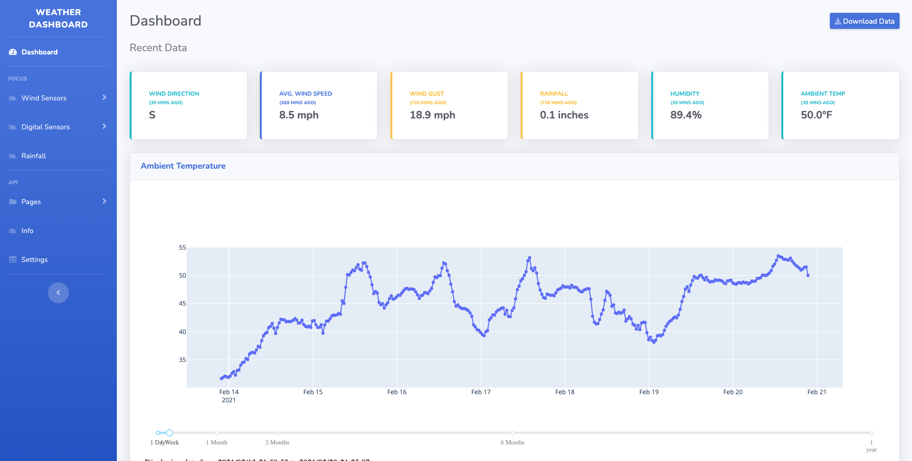

# Weather Dashboard

 

A weather dashboard designed to display information from
the [Raspberry Pi Weather Station](https://projects.raspberrypi.org/en/projects/build-your-own-weather-station), works
with a MongoDB database.

Detailed documentation is in the `docs` directory.

If any problems occur, open an issue.

*Dependencies:*

* Python 3 or above

## Quick Start

Basic steps on setting up the dashboard for your own LAN

1. Clone the repository or download the source code from the latest release. This can be done a few ways as stated
   below:
    1. Use command line tools to clone the repo, `git clone https://www.github.com/twosails/WeatherDashboard.git`
    2. Download the file from the `master` branch or other version branches to get specific features. This can be done
       by clicking the green `code`  button in the top right corner.
	3. Download source code `.zip`  from the latest release.
2. Navigate into the cloned repo ‘`cd WeatherDashboard`’, and then install the requirements by using the
   command: `python3 -m pip install -r requirements.txt`
   This should install all required dependencies, but if a `ModuleNotFoundError` occurs, open an issue and manually
   install the library/module
4. Migrate the Django app to make sure that the changes are applied to the app, use the
   command: `python3 manage.py migrate`
5. Create a SuperUser to access the Django Admin page, use `python3 manage.py createsuperuser`

> The configuration is required for an error to not occur when loading into the `dashbaord` page.
> Configuration can be done by manually editing the config file in `WeatherDashboard/weatherapp/util/config.yml`
> Or it can be configured n the Django Admin Page, requiring a restart to apply changes

7. You are now able to *run the server* and/or host it. This can be done by the command `python3 manage.py runserver`
8. Ensure that the config has been configured in order for the app to work

## Details

For more details about how to use this system and configure settings, go to
the `docs`  [directory](https://github.com/TwoSails/WeatherDashboard/tree/master/docs) or in
the [wiki](https://github.com/TwoSails/WeatherDashboard/wiki).

## Contributing

This was a personal project developed by [@twosails](https://github.com/twosails)
Feel free to open an [issue](https://github.com/TwoSails/WeatherDashboard/issues)
or [pull request](https://github.com/twosails/WeatherDashboard/pulls) to add/suggest an idea for future features or
support.

Any contributions are welcomed and appreciated 
